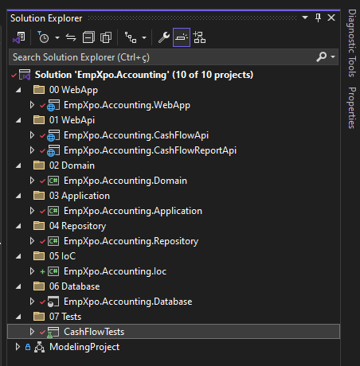
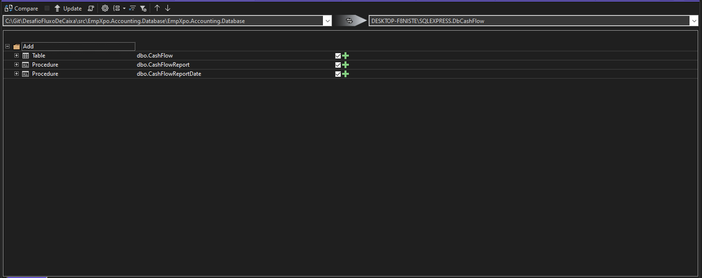
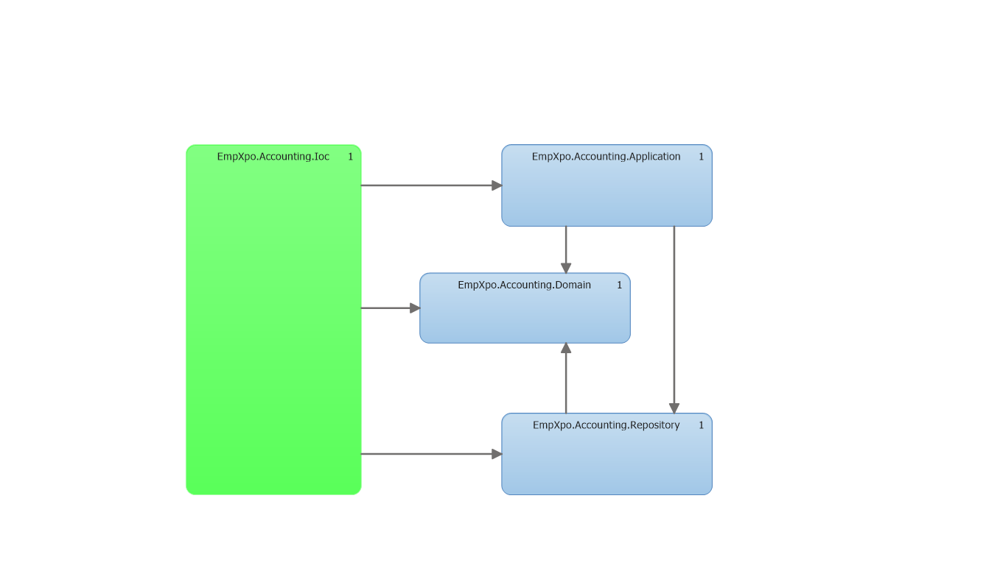
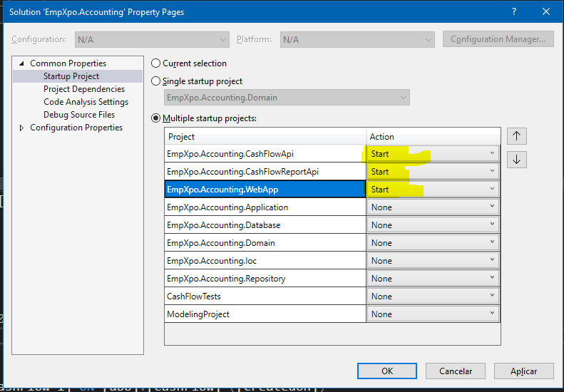
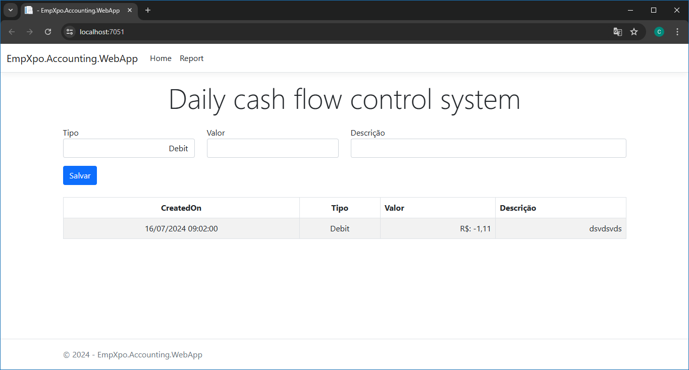
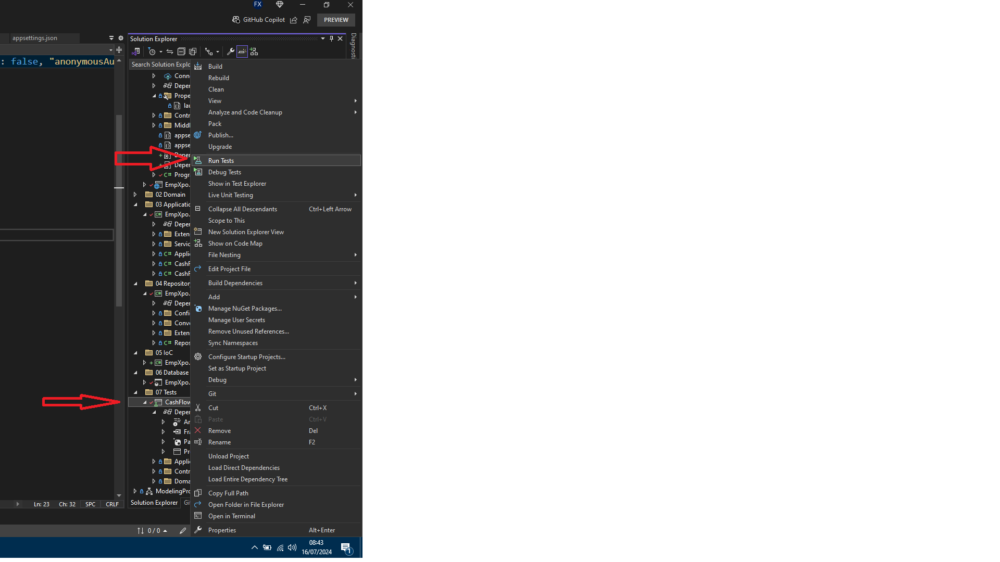

# DesafioFluxoDeCaixa
Projeto de Fluxo de Caixa

Desenvolvimento de uma aplicação para controle de Fluxo de Caixa.

## Tecnologias Utilizadas

- Microsoft Visual Studio Enterprise 2022
- C#
- Asp.Net WebApi
- Asp.Net MVC
- Swagger
- XUnit
- Moq
- Dapper
- Sql Server / Sql Server Management Studio
- FluentValidation
- RESTful

## Padrões de Design
- Domain Driven Design(DDD)
- Inversion of Control (IoC ou inversão de controle)
- Model-View-ViewModel (MVVM)
- Repository Pattern (com Dapper)
- [Options pattern](https://learn.microsoft.com/en-us/aspnet/core/fundamentals/configuration/options?view=aspnetcore-8.0)
- [Chain of Responsibility (.Net8 Middleware)](https://learn.microsoft.com/pt-br/aspnet/core/fundamentals/middleware/?view=aspnetcore-8.0)

## Solução
A solução foi organizada em pastas conforme a figura abaixo.

 <br><br>

- "00 WebApp" está a aplicação principal feita em Asp.Net MVC aonde o cliente poderá fazer o lançamento de credito e debito e visualizar o relatório consolidado do dia
- "01 WebApi" estão a Apis que disponibiliza as informações do fluxo de caixa utilizado no projeto MVC.
- "02 Domain", "03 Application", 04 Repository", "05 IoC" são as camadas da aplicação utilizados nos projetos MVC e WebApi
- "06 Database" está o projeto de banco de dados.
   Com este projeto é possível ver facilmente ver as ultimas alterações, comparar os objetos do banco de dados, gerar scripts para alteração e caso necessário fazer updates 

 <br><br>

- "07 Tests" estão os testes de unidades das classes do sistema


Em "ModelingProject podemos ver o diagrama de dependências do projeto.
Utilizamos Inversion of Control e DDD para temos os seguintes benefícios:

1) Baixo acoplamento no código
2) Facilidade de manutenção e evolução do código
3) Facilidade para testar o código
4) Segregação das responsabilidades
5) Compartilhamento de conhecimento com outros desenvolvedores

 <br><br>

Utilizamos a micro ORM dapper ao invés do EntityFramework pois o dapper é performático no cenário de pico de 500 inclusões por segundo.

Criamos uma aplicação WebMvc para o cliente fazer os lançamentos de crédito e débito e duas WebApi uma para os lançamento e outra para relatório
Assim caso ocorra alguma indisponibilidade na api do relatório o sistema de lançamentos continuará funcionando.

No sistema de relatório criamos duas procedures para melhorar a performance do banco de dados e um indice ('Ind_CashFlow_1') na tabela 'CashFlow' coluna 'CreatedOn'


## Execução da aplicação
Para executar o projeto segui as seguintes etapas
1) Abra o "Sql Server Management Studio" e crie uma nova consulta em branco   
   Entre na pasta "src\EmpXpo.Accounting.Database\Scripts"
   Utilize o arquivo "banco.sql" para criar o banco de dados, tabelas e procedure

3) Pegue a string de conexão para o banco "DbCashFlow" criado anteriormente pelo script

4) Abra a solução src/EmpXpo.Accounting.sln com o Visual Studio

5) Dentro do "Visual Studio" entre nos projetos "01 WebApi/EmpXpo.Accounting.CashFlowApi" e "01 WebApi\EmpXpo.Accounting.CashFlowReportApi"   
   Altere a ConnectionStrings que está no arquivo appsettings.Development.json para ConnectionStrings da sua maquina
   
   ```
   "ConnectionStrings": {
		"cnSqlCacheFlow": "Sua ConnectionString aqui!"
	}
   ```

7) Caso a aplicação "00 WebApp/EmpXpo.Accounting.WebApp" não encontre o endereço das Apis

   Verifique o enereço de execução dos projetos "01 WebApi/EmpXpo.Accounting.CashFlowApi" e "01 WebApi\EmpXpo.Accounting.CashFlowReportApi"
   no arquivo "Properties/launchSettings.json"

   Coloque esse novo endereço no projeto "00 WebApp/EmpXpo.Accounting.WebApp"
   no arquivo "appsettings.Development.json"
   
   
   ```
    "cnCashFlowReportApi": "https://localhost:7255/CashFlowReport",
	"cnCashFlowApi": "https://localhost:7162/CashFlow",
   ```
   
8) Ajuste o "Startup Projects" do Visual Studio conforme a figura abaixo:
    A aplicação MVC deve  iniciar após as WebApis

     <br><br>

O sistema em execução no ambiente de Dev deve parecer conforme as imagens abaixo

   <br><br>
  
## Testes
Para executar os testes de unidade dentro do Visual Studio acesse a pasta "07 Tests/CashFlowTests"

Clique com o botão direito no projeto "CashFlowTests" click em "Run Tests"

 <br><br>
